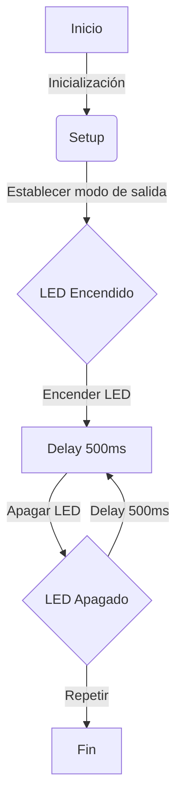
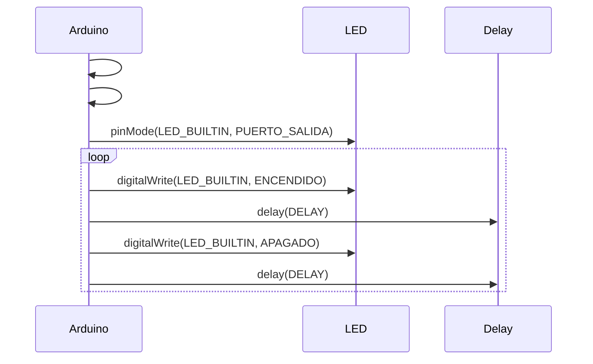

# Practica 1 PD 
ALVARO RAMO IRURRE (COMPAÑERO : ELOI BELMONTE)

En esta práctica, programaremos un ESP32 para generar el parpadeo periódico de un LED.

# 1.Codigo Básico

En este apartado se presenta un código de ejemplo que permite implementar la funcionalidad de parpadeo del LED en el ESP32.

```c++

#define LED_BUILTIN 2
#define DELAY 500

void setup() {
 pinMode(LED_BUILTIN, OUTPUT);
}
void loop() {
 digitalWrite(LED_BUILTIN, HIGH);
 delay(DELAY);
 digitalWrite(LED_BUILTIN, LOW);
 delay(DELAY);
}

```
# 2. Modificar el programa (ON, OFF)

```c++

#include <Adafruit_NeoPixel.h>


#define LED_PIN 48    // Cambia a 8, 13 o el pin del LED RGB
#define NUM_LEDS 1


Adafruit_NeoPixel led(NUM_LEDS, LED_PIN, NEO_GRB + NEO_KHZ800);


void setup() {
 led.begin();
 led.setBrightness(50);  // Ajusta el brillo del LED
}


void loop() {
 led.setPixelColor(0, led.Color(255, 0, 0));  // LED en rojo
 led.show();
 delay(500);


 led.setPixelColor(0, led.Color(0, 0, 0));  // LED en verde
 led.show();
 delay(500);


}

```

En esta sección se incluye un ejemplo de código que implementa el parpadeo del LED en el ESP32, permitiendo observar su funcionamiento básico.

# 3. Modificar programa para que actue en los registros de entrada de salida

```c++

#include <Arduino.h>
#define LED_PIN 2
#define DELAY 1000

void setup() {
    pinMode(LED_PIN, OUTPUT);
    Serial.begin(115200);
}

void loop() {
    volatile uint32_t *gpio_out = (uint32_t *)GPIO_OUT_REG;  // Apuntar al registro de salida

    Serial.println("ON");
    *gpio_out |= (1 << LED_PIN);  // Encender LED
    delay(DELAY);

    Serial.println("OFF");
    *gpio_out &= ~(1 << LED_PIN); // Apagar LED
    delay(DELAY);
}

```

El código presentado en este apartado ha sido ajustado con el objetivo de manipular directamente los registros de entrada y salida. 
Se han incorporado las recomendaciones relativas a gpio_out para lograr este control.


# 4. Medir frecuencia máxima 
En este apartado se cambiará el pin de salida a otro disponible y, mediante el uso de un osciloscopio, se medirá la frecuencia máxima de conmutación del LED. 
La medición se realizará en cuatro escenarios diferentes.

## 4.1 Con el envio por puerto série del mensaje y utilizando las funciones del Arduino

```c++

 #include <Arduino.h>

   int led = 14; 

   void setup() {                
      pinMode(led, OUTPUT);   
      Serial.begin(115200);
   }

   void loop() {
      Serial.println("ON");
      digitalWrite(led, HIGH);
      Serial.println("OFF");      
      digitalWrite(led, LOW);
   }

   ```
Hemos definido el pin de salida en el pin 14, respecto a la frecuencia registrada en el osciloscopio es de 30 Khz.

## 4.2 - Con el envio por puerto série y accediendo directamente a los registros

```c++

 #include <Arduino.h>

   int led = 14;
   uint32_t *gpio_out = (uint32_t *)GPIO_OUT_REG;

   void setup() {                
      pinMode(led, OUTPUT);   
      Serial.begin(115200);
   }

   void loop() {
      Serial.println("ON");
      *gpio_out |= (1 << led);
      Serial.println("OFF");      
      *gpio_out ^= (1 << led);
   }

```
En este caso anterior con el pin de salida en el 14, hay registrada una frecuencia de 30 Khz.

## 4.3 - Sin el envio por el puerto série del mensaje i utilizando las funciones de Arduino

```c++

#include <Arduino.h>
int led = 14; 

void setup() {                
   pinMode(led, OUTPUT);   
}

void loop() {
   digitalWrite(led, HIGH);
   digitalWrite(led, LOW);
}

```
En este tercer caso se registra una frecuencia en el osciloscopio de 1.7 Mhz.

## 4.4 - Sin el envio por el puerto série y accedirendo directamente a los registros

```c++

#include <Arduino.h>

int led = 14; 
uint32_t *gpio_out = (uint32_t *)GPIO_OUT_REG;

void setup() {                
   pinMode(led, OUTPUT);   
}

void loop() {
   *gpio_out |= (1 << led);
   *gpio_out ^= (1 << led);
}

```
Y en este último caso se registra una frecuencia de 4.7 Mhz en el osciloscopio.

# 5. Diagrama de flujo i diagrama de tiempo

A continuación se proporciona el diagrama de flujo i el diagrama de tiempos, tomando como ejemplo el código básico proporcionado en el punto 1 de esta práctica.

# 5.1. Diagrama de flujo


En el diagrama de flujo se muestra el funcionamiento del codigo:

  1- Se inicia, se establece el modo de salida.

  2- El LED se enciende, pasa el tiempo del DELAY (en este caso he tomado como ejemplo 500ms) y se apaga.

  3- Una vez apagado, vuelve a pasar el tiempo del DELAY y en este caso se enciende.

# 5.2. Diagrama de tiempo


En este diagrama de tiempos se puede ver el funcionamiento de la práctica, teniendo como referencia el Arduino, el LED y el tiempo del Delay.

# 6. Tiempo libre del procesador

El tiempo libre que tiene el procesador se puede definir con el siguiente calculo:

Tiempo libre del procesador = Tiempo total de un ciclo - Tiempo ocupado en ejecución del bucle

Sabiendo el tiempo total de un ciclo marcado y calculado, con Delay, y sabiendo el tiempo que el procesador está ocupado haciendo la ejecución del bucle, haciendo la resta de estas anteriores, podemos conocer el tiempo libre que tiene el procesador.

# Enlaces de videos grabados en el laboratorio

Blinking : 

(https://drive.google.com/file/d/1eTlATIZovivdxMkGzjndjhG19jlPRpGX/view?usp=drive_link) 

Osciloscopio : 

(https://drive.google.com/file/d/1WEEPicZ2BTcfCuieqvVL76HsG5R53JyU/view?usp=drive_link)
