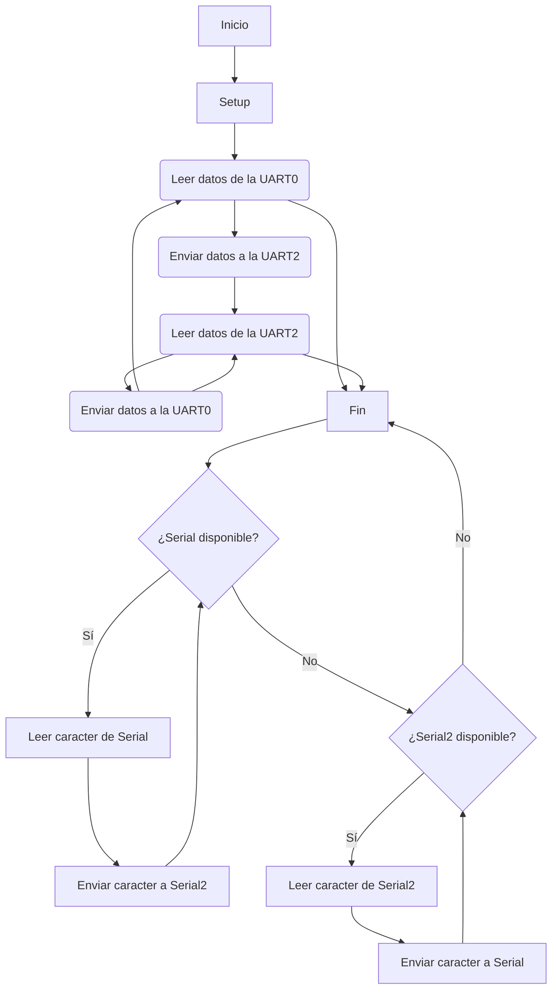

# Práctica 8 PD ALVARO RAMO IRURRE (COMPAÑERO : ELOI BELMONTE)

En esta octava práctica aplicaremos el cruce entre un teclado y un monitor, usando los puertos UART0 y UART2.

### Diagrama de flujo : 



## Ej 1

```c++
#include <Arduino.h>

void setup() {
  Serial.begin(115200);   // Inicializar Serial (UART0)
  Serial2.begin(115200);  // Inicializar Serial2 (UART2)
}

void loop() {
  // Leer datos de la UART0 y enviarlos a la UART2
  if (Serial.available()) {
    char c = Serial.read();
    Serial2.write(c);
  }

  // Leer datos de la UART2 y enviarlos a la UART0
  if (Serial2.available()) {
    char c = Serial2.read();
    Serial.write(c);
  }
}
```

### Funcionamiento y output :

El código permite la comunicación en ambas direcciones entre el Arduino y otros dispositivos conectados a través de UART2. 
Al mismo tiempo manteniendo la capacidad de depuración y comunicación con la computadora a través del puerto USB (UART0). 

Output : 

La salida será igual a la entrada.

Ej : entrada --> hola mundo, salida --> hola mundo


